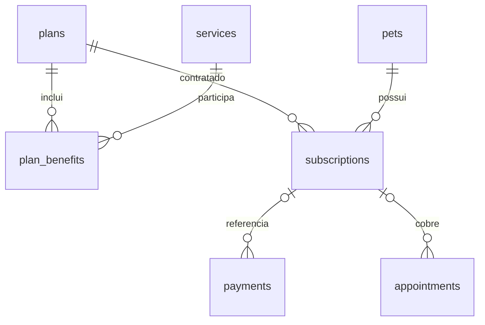

# Planos e assinaturas — segunda etapa

## O modelo implementado

| Tabela | O que representa | Exemplo |
| --- | --- | --- |
| plans | Definição do plano, preço e duração | Básico, R$ 99, 30 dias |
| services | Catálogo de serviços avulsos | Banho, R$ 60 |
| plan_benefits | Relação entre planos e serviços incluídos | Básico inclui Banho e Tosa |
| subscriptions | Contratação de um plano por um pet | Thor, Básico, início e fim |

`plan_benefits` representa uma relação muitos para muitos: um plano inclui vários serviços e um serviço pode fazer parte de vários planos. A chave primária composta por `plan_id` e `service_id` impede repetir o mesmo benefício.

Os planos e serviços são globais, conforme a tabela fixa do MVP. As assinaturas pertencem a uma loja e a um pet. As rotas de consulta filtram pela loja e, para clientes, pelo tutor.



## Regras adotadas para esta etapa

- Uma compra inicia imediatamente um ciclo de 30 dias, sem renovação automática. Essa duração é uma decisão inicial do MVP, não uma definição de mês civil.
- Uma nova compra marca as assinaturas anteriores ativas do pet como `replaced` e inicia outro ciclo completo. Não há cálculo proporcional, crédito ou reembolso.
- O limite final é exclusivo: no instante de `ends_at`, o plano já venceu.
- O status `expired` é calculado na consulta. Não precisamos de uma tarefa periódica para alterar registros vencidos.
- Básico e Premium incluem Banho e Tosa. Premium Plus inclui os cinco serviços atuais.
- A cobertura é validada pelo backend na data do agendamento, sem confiar na seleção do frontend.
- Um agendamento avulso continua exigindo pagamento mesmo se o pet tiver assinatura.
- O agendamento guarda `subscription_id`, preservando o vínculo histórico. Uma simples atualização de status não exige assinatura ainda vigente. Alterar data, serviço ou forma de cobrança exige nova validação.
- O pagamento guarda o valor praticado na compra, sem aceitar o valor enviado pelo cliente. Preço de plano/serviço é lido do banco.
- Uma senha inválida para dinheiro desfaz as alterações pendentes. Pagamento e assinatura são salvos juntos em uma transação: ambos são confirmados ou nenhum deles.

PIX e cartão continuam simulados: esta etapa não confirma transações em um provedor financeiro. A interface e os metadados do catálogo continuam usando definições fixas; alterações de catálogo deverão sincronizar essas definições em uma evolução futura. Na etapa 6, a cobertura passou a usar os serviços e limites copiados na assinatura, preservando a contratação; veja `cotas-dos-planos.md`.

## Migração e legado

A migração `1d532c0cfeb8` cria as quatro tabelas, carrega o catálogo fixo e adiciona `subscription_id` a pagamentos e agendamentos. Ela contém seus próprios dados para continuar reproduzível mesmo se o catálogo da aplicação mudar.

O campo antigo `pets.plan` permanece apenas para compatibilidade com o legado. A API passa a retornar `plan` calculado a partir da assinatura vigente. Alterar esse texto diretamente não concede cobertura.

Pets legados com nomes reconhecidos recebem uma assinatura marcada `source=legacy`, válida por 30 dias a partir da migração. Não conhecemos a data original nem o pagamento: esse vínculo é uma concessão de transição explícita, não uma reconstrução de compra. Faça backup e revise essa política antes de migrar dados reais.

Na migração, agendamentos antigos sem pagamento e com serviço incluído recebem vínculo à assinatura legada se sua data for anterior ao fim da concessão. Isso preserva a classificação dos registros anteriores, incluindo históricos. Serviços fora dos benefícios não recebem essa cobertura.

O seed cria vínculos marcados `source=demo`. Compras pelo checkout usam `source=purchase`. Excluir pets ainda segue a exclusão física do MVP: pagamentos são desvinculados das assinaturas e as assinaturas do pet são removidas. A preservação integral de histórico e a política de exclusão continuam pendentes.

## Executar e testar

Na pasta `backend`, usando o ambiente local desta revisão:

```powershell
..\.venv\Scripts\python.exe -m flask --app app db upgrade
..\.venv\Scripts\python.exe -m unittest discover -s tests -v
```

Os testes criam bancos temporários separados, aplicam as migrações e não modificam seu banco de desenvolvimento. Foram verificados: correspondência entre modelos e esquema; migração do legado; compra e substituição; senha inválida; cobertura e cobrança avulsa; vencimento; isolamento de consulta e compra entre lojas.

`GET /api/subscriptions`, com token JWT, retorna o histórico autorizado. `GET /api/pets` inclui `subscription` e calcula o nome do plano vigente. O frontend existente continua funcionando com o campo `plan`; esta etapa não acrescenta uma tela de histórico de assinaturas.

## Pendências de regra de negócio

Atualização de 29/09/2026: as cotas separadas de Banho e Tosa foram definidas e implementadas em blocos desde a contratação. Cada extra do Plus tem um uso por ciclo; cancelamentos liberam uso e faltas consomem. A migração `c83f9e205d16` guarda limites contratados e a API valida a quantidade. Veja `cotas-dos-planos.md` para a regra completa e a transição dos dados existentes.

Continuam pendentes: proteção de compras repetidas e concorrentes; fuso horário dos agendamentos; pagamentos reais; regras de renovação e reembolso; banco externo persistente. A integridade entre lojas foi implementada nas etapas 3 a 5. A reserva concorrente da última cota pela API foi tratada na etapa 6. A validação realizada foi em SQLite local.
