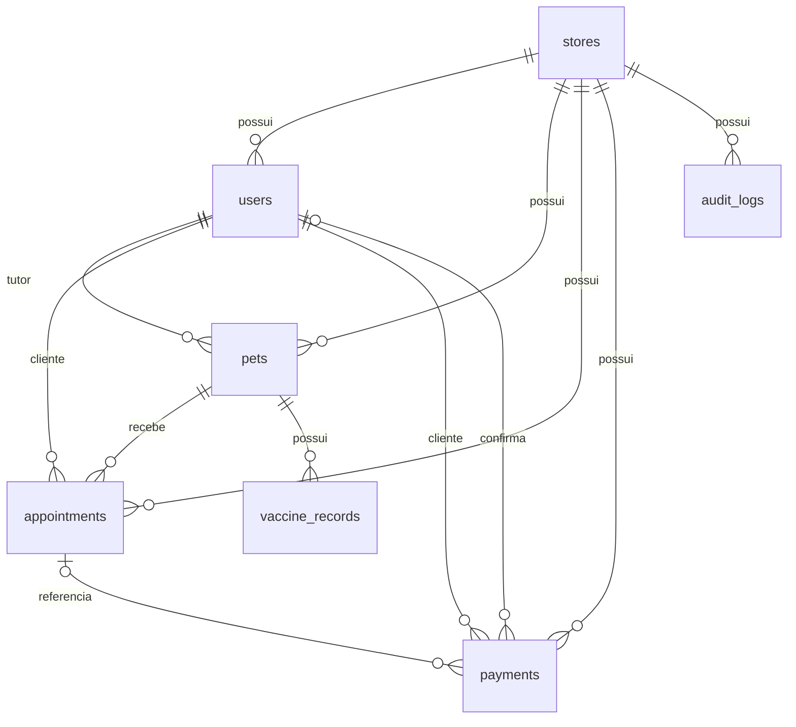

# Banco de dados do PetLify — primeira etapa

Este guia registra a primeira etapa. A evolução de planos e assinaturas está implementada e descrita em [assinaturas.md](assinaturas.md).

## O que já funciona

O banco local está em `backend/instance/petlify.db`. Flask-SQLAlchemy resolve `sqlite:///petlify.db` a partir da pasta `instance` do aplicativo. O arquivo não deve entrar no GitHub; os modelos e as migrações devem.

SQLAlchemy é o ORM: converte objetos Python em registros e consultas SQL. `models.py` descreve a estrutura desejada. Alembic, integrado pelo Flask-Migrate, registra as mudanças dessa estrutura em arquivos versionados.

A primeira migração, `9184049026b0`, cria as sete tabelas atuais. A tabela adicional `alembic_version` informa qual migração já foi aplicada.

## Relacionamentos atuais



`id` é a chave primária: identifica um registro. Uma chave estrangeira, como `pets.owner_id`, aponta para o registro relacionado em outra tabela. `nullable=False` exige o preenchimento. Um índice ajuda consultas; um índice único também impede valores repetidos.

`store_id` identifica a loja. Os filtros do backend precisam usá-lo para isolar lojas. As chaves estrangeiras atuais garantem que os registros relacionados existam, mas ainda não garantem que todos pertençam à mesma loja. Essa proteção deverá ser reforçada antes de uso real.

No modelo atual, e-mail e CPF são únicos em toda a plataforma e cada usuário pertence a uma loja. Permitir um cliente em várias lojas exigirá uma tabela de vínculos e revisão da autenticação.

## Rodar localmente no Windows

Com as dependências instaladas, na pasta `backend`:

```powershell
python -m flask --app app db upgrade
python seed_dev.py
python -m flask --app app run
```

Se usar o ambiente criado nesta revisão, substitua `python` por `..\.venv\Scripts\python.exe`. O seed é opcional e destinado a demonstrações: redefine as contas de teste e pode adicionar agendamentos a cada execução em datas diferentes.

## Como evoluir o banco

Após editar os modelos:

```powershell
python -m flask --app app db migrate -m "Descrever a mudança"
# Leia e revise o arquivo gerado em migrations/versions.
python -m flask --app app db upgrade
python -m flask --app app db current
```

`migrate` gera a proposta de alteração. `upgrade` aplica essa proposta. A geração automática precisa de revisão, especialmente em renomeações e mudanças de tipos.

Se já existir um banco antigo criado por `create_all`, faça backup e compare seu esquema com a migração inicial antes de usar `db stamp 9184049026b0`. `stamp` apenas marca a versão: não cria nem corrige tabelas. Não execute `upgrade` inicial sobre tabelas antigas sem preparar essa adoção.

## Próxima etapa do modelo

O catálogo está em `backend/catalog.py`, com valores fixos da plataforma. `Pet.plan` guarda somente um nome, sem início, vencimento ou histórico. A evolução proposta é:

| Entidade | Responsabilidade |
| --- | --- |
| Plano | Definição e preço do plano oferecido |
| Serviço | Definição do serviço avulso |
| Benefício do plano | Serviços incluídos e limites de uso |
| Assinatura | Pet, plano, início, fim e status |
| Pagamento | Valor histórico e vínculo com a compra |

O preço pago deve permanecer registrado mesmo que o catálogo mude. Precisamos definir como contar a frequência de utilização e quando a assinatura começa antes de implementar essas regras.

Outras melhorias pendentes: `birth_date` como `Date` com validação da API; política de preservação do histórico ao excluir contas; proteção contra agendamentos concorrentes; datas e horários com tratamento de fuso; integridade entre registros da mesma loja.

## Deploy

O início do Render agora aplica `flask db upgrade`. O seed só roda com `SEED_DEMO=true`; deixe-o desligado em um banco com dados reais. Não registramos a URL completa do banco no log, pois ela pode conter senha.

O SQLite em `/tmp` continua temporário. Esta etapa não configurou um banco externo persistente. O projeto inclui o driver PyMySQL; outros bancos podem exigir um driver adicional.

## Validação realizada

- Migração inicial aplicada em um SQLite vazio.
- Seed executado: 2 lojas, 6 usuários, 5 pets, 6 agendamentos e 5 pagamentos.
- Comparação Alembic: nenhuma diferença entre banco e modelos.
- Reexecução de `upgrade`: sem recriar as tabelas.
- Endpoint `/api/health`: resposta HTTP 200.

A validação cobre SQLite local, não o deploy nem outro banco relacional.
