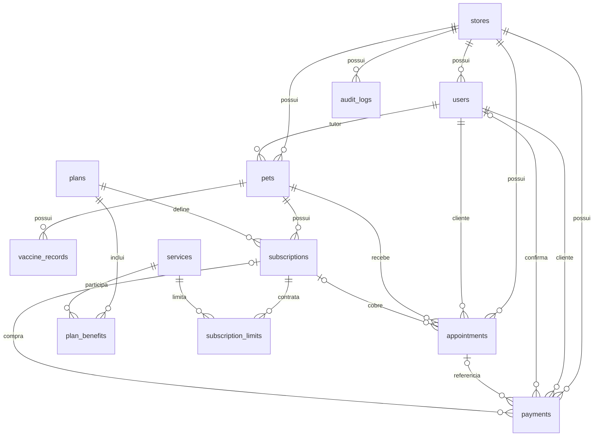

# Banco de dados do PetLify

Atualizado em 02/10/2026. O esquema atual inclui seis migrações, assinaturas e cotas. As regras estão em [assinaturas.md](assinaturas.md) e [cotas-dos-planos.md](cotas-dos-planos.md). A sequência aprovada está em [ROTEIRO.md](ROTEIRO.md).

## O que já funciona

O banco local está em `backend/instance/petlify.db`. Flask-SQLAlchemy resolve `sqlite:///petlify.db` a partir da pasta `instance` do aplicativo. O arquivo não deve entrar no GitHub; os modelos e as migrações devem.

SQLAlchemy é o ORM: converte objetos Python em registros e consultas SQL. `models.py` descreve a estrutura desejada. Alembic, integrado pelo Flask-Migrate, registra as mudanças dessa estrutura em arquivos versionados.

A primeira migração, `9184049026b0`, criou sete tabelas. Agora são 12 tabelas de domínio: stores, users, pets, vaccine_records, appointments, payments, audit_logs, plans, services, plan_benefits, subscriptions e subscription_limits. A revisão atual é `c83f9e205d16`; `alembic_version` informa a revisão aplicada.

## Relacionamentos atuais



`id` é a chave primária: identifica um registro. Uma chave estrangeira, como `pets.owner_id`, aponta para o registro relacionado em outra tabela. `nullable=False` exige o preenchimento. Um índice ajuda consultas; um índice único também impede valores repetidos.

`store_id` identifica a loja. Os filtros do backend isolam consultas; as chaves compostas das etapas 3 a 5 protegem loja e vínculos exatos de tutor, pet, assinatura e pagamento. Uma chave no banco não substitui a autorização da API.

No modelo atual, e-mail e CPF são únicos em toda a plataforma e cada usuário pertence a uma loja. Permitir um cliente em várias lojas exigirá uma tabela de vínculos e revisão da autenticação.

## Rodar localmente no Windows

Com as dependências instaladas, na pasta `backend`:

```powershell
python -m flask --app app db upgrade
python seed_dev.py
python -m flask --app app run
```

Se usar o ambiente criado nesta revisão, substitua `python` por `..\.venv\Scripts\python.exe`. O seed é opcional e destinado a demonstrações: redefine as contas de teste e pode adicionar agendamentos a cada execução em datas diferentes.

## Como evoluir o banco

Após editar os modelos:

```powershell
python -m flask --app app db migrate -m "Descrever a mudança"
# Leia e revise o arquivo gerado em migrations/versions.
python -m flask --app app db upgrade
python -m flask --app app db current
```

`migrate` gera a proposta de alteração. `upgrade` aplica essa proposta. A geração automática precisa de revisão, especialmente em renomeações e mudanças de tipos.

Se já existir um banco antigo criado por `create_all`, faça backup e compare seu esquema com a migração inicial antes de usar `db stamp 9184049026b0`. `stamp` apenas marca a versão: não cria nem corrige tabelas. Não execute `upgrade` inicial sobre tabelas antigas sem preparar essa adoção.

## Catálogo e assinatura atuais

O catálogo está nas tabelas e ainda tem definições fixas no backend/frontend. Pet.plan permanece legado; a API calcula o plano pela assinatura vigente. As entidades implementadas são:

| Entidade | Responsabilidade |
| --- | --- |
| Plano | Definição e preço do plano oferecido |
| Serviço | Definição do serviço avulso |
| Benefício do plano | Serviços incluídos e limites de uso |
| Assinatura | Pet, plano, início, fim e status |
| Pagamento | Valor histórico e vínculo com a compra |
| Limite contratado | Cópia de quantidade/período por serviço da assinatura |

O preço pago fica no pagamento; os limites contratados ficam em subscription_limits. Cada compra inicia 30 dias. Banho e tosa têm cotas separadas em blocos de 7 ou 15 dias; extras do Plus têm um uso por ciclo. Mudanças no catálogo não alteram os limites contratados.

Pendentes: birth_date como Date; retenção de histórico; concorrência da lotação entre assinaturas diferentes e de compras; implantação do banco persistente. Datas/fuso foram tratados no [passo 3](datas-e-horarios.md). A disputa pela última cota de uma assinatura foi testada em SQLite e PostgreSQL local.

## Deploy

O início do Render verifica conexão, aplica `flask db upgrade` e verifica revisão/tabelas antes de iniciar a aplicação. O seed só roda com `SEED_DEMO=true`; deixe-o desligado em um banco com dados reais. Não registramos a URL completa do banco no log, pois ela pode conter senha.

Produção agora exige conexão externa explícita e rejeita SQLite; desenvolvimento ainda pode usá-lo. PostgreSQL no Neon Free foi preparado com Psycopg 3.3.6. Conexão com o serviço e implantação ainda pendentes. O [guia de persistência](banco-persistente.md) registra backup/restauração, limites gratuitos e evolução para um plano pago. Trocar a URL não transfere os registros SQLite.

## Validação realizada

- Migração inicial aplicada em um SQLite vazio.
- Seed executado: 2 lojas, 6 usuários, 5 pets, 6 agendamentos e 5 pagamentos.
- Comparação Alembic: nenhuma diferença entre banco e modelos.
- Reexecução de `upgrade`: sem recriar as tabelas.
- Endpoint `/api/health`: resposta HTTP 200.

A lista acima registra a validação inicial em SQLite, anterior aos passos 3–4.

Os itens acima registram a etapa inicial. Em 30/09/2026, 24 testes de backend passaram, incluindo modelos/migrações, cotas, autorização, concorrência na última cota e rotas da interface. O frontend compilou com TypeScript/Vite. A jornada principal do passo 2 foi validada; resultados e limites estão em [validacao-jornada.md](validacao-jornada.md).

Em 02/10/2026, a preparação do passo 4 aprovou 39 testes de backend e 13 verificações em PostgreSQL 18.4 temporário. Migrações/modelos sem diferenças, cotas e concorrência, isolamento por loja, reinício e restauração integral verificados. Não houve migração do banco de desenvolvimento nem implantação na nuvem.
