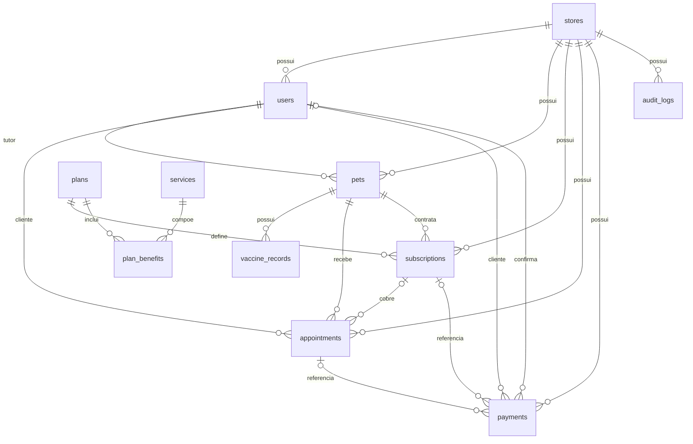

# PetLify — esquema e roteiro de estudo

Registro de retomada: 24/09/2026. Este documento descreve os modelos locais atuais e propõe uma divisão de trabalho para revisão pelo grupo.

## 1. Entender as três partes

O frontend React apresenta formulários e envia requisições HTTP. O backend Flask autentica o usuário, valida regras e consulta o banco através do SQLAlchemy. O banco guarda os registros entre as requisições.

Por exemplo: ao contratar um plano, a tela informa o pet e o plano escolhido. O backend verifica o tutor e a loja, consulta o preço e registra pagamento e assinatura. A tela não define o preço autorizado.

## 2. Ler o esquema atual

São 11 tabelas de domínio. `alembic_version` é uma tabela técnica adicional para acompanhar migrações.

| Grupo | Tabelas | Responsabilidade |
| --- | --- | --- |
| Loja e acesso | stores, users | Loja, conta e perfil de acesso |
| Animais | pets, vaccine_records | Tutor, pet e vacinação |
| Catálogo global | plans, services, plan_benefits | Ofertas e serviços incluídos |
| Contratação | subscriptions | Pet, plano e validade |
| Operação | appointments, payments | Atendimento e cobrança |
| Auditoria | audit_logs | Registro de ações |



`||` representa um; `o{` representa zero ou muitos; `o|` representa zero ou um. As relações refletem as chaves estrangeiras declaradas nos modelos, não garantias adicionais de regra de negócio. `audit_logs.user_id` é um identificador sem chave estrangeira atualmente.

## 3. Entender as chaves com um exemplo

Imagine a loja 1, a usuária 10 e o pet 20. O pet tem `owner_id=10` e `store_id=1`. `id` é a chave primária do registro; `owner_id` é uma chave estrangeira para `users.id`.

Uma assinatura aponta para o pet 20 e para `plan-basic`. Uma nova compra pode criar outra assinatura do mesmo pet, mantendo a anterior no histórico como substituída. Por isso a relação pet–assinatura é um para muitos.

Um plano inclui vários serviços e o mesmo serviço pode estar em vários planos. `plan_benefits` resolve essa relação muitos para muitos. Seu par `(plan_id, service_id)` é a chave primária composta: não pode haver duas linhas idênticas para o mesmo benefício.

## 4. Acompanhar uma consulta SQL

Exemplo somente de leitura para uma loja. Substitua o identificador da loja pelo contexto autorizado; na API ele vem do usuário autenticado, e deve ser passado como parâmetro à consulta.

```sql
SELECT p.name AS pet,
       u.name AS tutor,
       pl.name AS plano,
       s.starts_at AS inicio,
       s.ends_at AS fim,
       s.status AS status_armazenado
FROM subscriptions AS s
JOIN pets AS p ON p.id = s.pet_id AND p.store_id = s.store_id
JOIN users AS u ON u.id = p.owner_id AND u.store_id = p.store_id
JOIN plans AS pl ON pl.id = s.plan_id
WHERE s.store_id = 1
ORDER BY s.id DESC;
```

`JOIN` reúne dados de tabelas relacionadas sem repetir o nome do tutor em cada assinatura. A consulta mostra histórico, incluindo substituídas e vencidas. O status armazenado `active` sozinho não significa vigência: o backend também verifica início e fim. Para um cliente, a consulta ainda precisa restringir o tutor autorizado.

## 5. Identificar o que ainda precisa evoluir

- As chaves estrangeiras simples não garantem que o tutor, pet, assinatura e agendamento pertençam à mesma loja. É necessário fortalecer essa integridade e verificar a aplicação das chaves no SQLite.
- `birth_date` ainda é texto; converter para `Date` exige validar a entrada e tratar dados antigos.
- `appointments.service` é texto, sem chave estrangeira para `services`.
- `pets.plan` ainda existe como legado; a API calcula o plano vigente pela assinatura.
- Catálogo do frontend e metadados do backend ainda usam listas fixas. A existência de tabelas não eliminou toda duplicação.
- Limites semanais e quinzenais, concorrência, pagamentos reais, exclusão de históricos e fuso horário continuam pendentes.

## 6. Dividir o trabalho simultâneo

Proposta a confirmar com Calebe: Codex trabalha no banco, backend e testes; Claude trabalha no frontend. Os dois precisam partir da mesma versão atual, que contém as migrações e assinaturas. A cópia do GitHub pode não conter estas mudanças locais.

Antes de editar, combinar arquivos e objetivo. Evitar que duas ferramentas alterem `backend/models.py`, `backend/api.py` ou criem migrações simultaneamente. O Git atual mostra `PetLify-Copia/` como não rastreado: ainda falta estabelecer uma versão compartilhada em commits.

Mensagem sugerida para repassar ao Claude:

> Estou desenvolvendo o PetLify em grupo. Estamos coordenando alterações do banco e backend com o Codex. Comece pela leitura do frontend e dos guias docs/assinaturas.md e docs/roteiro-esquema-e-colaboracao.md. Proponha uma tela de histórico usando GET /api/subscriptions. Preserve o contrato da API e informe qualquer campo adicional necessário. Aguarde a definição dos arquivos sob sua responsabilidade antes de editar arquivos compartilhados.

## 7. Sequência de aprendizagem e implementação

1. Conferir este diagrama e explicar com suas palavras plano, assinatura e pagamento.
2. Confirmar a divisão com o Claude e estabelecer uma versão compartilhada do projeto.
3. Reforçar integridade entre lojas e adicionar testes que tentam criar relações inválidas.
4. Definir as cotas com o grupo antes de implementar limites.
5. Integrar o histórico no frontend e testar o fluxo completo.
6. Escolher o banco persistente e validar a migração nesse banco.

Nesta retomada foi criado este roteiro, sem alteração do esquema ou das regras de assinatura.
